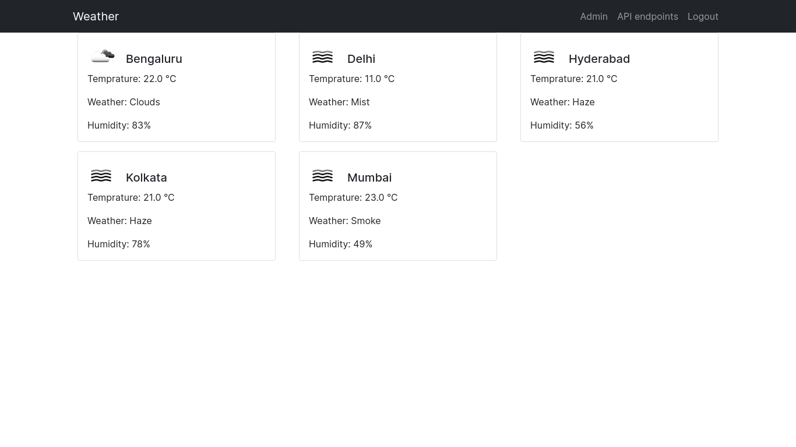
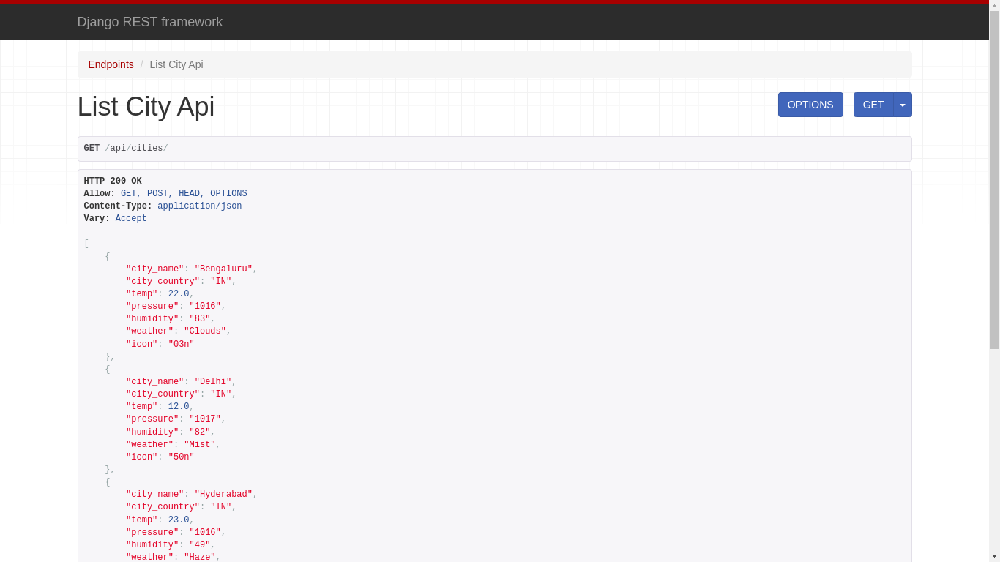

<div align="center">

# Weather Assignment

    A restful api for weather data and representation of city on homepage.

</div>



## 📖 Prerequisite
- OS used (ubuntu)
- Install 🐍 [Python3](https://www.python.org/)
- Install [PIP](https://pip.pypa.io/en/stable/installation/#supported-methods)
- Install [PostgreSQL](https://www.postgresql.org/download/linux/ubuntu/)
- Install [Docker](https://docs.docker.com/engine/install/ubuntu/)
- Install [Postman](https://learning.postman.com/docs/getting-started/installation-and-updates/#installing-postman-on-linux) for simple json web token or simple-jwt

## 📀 Running Demo
-   _Must have postgreSQL data details same as below for running or change according to your ease :_

    ```
    "NAME": "postgres",
    "USER": "postgres",
    "PASSWORD": "postgres",
    "HOST": "localhost",
    "PORT": 5432, # default port
    ```


<h2> Steps for running the instance of projects without docker :</h2>


```sh
git clone https://github.com/ogdhruv/weather-assignment.git
```
```sh
cd weather-assignment
```
```sh
python -m venv .venv
```
```sh
source .venv/bin/activate
```
```sh
pip install -r requirements.txt
```
```sh
python manage.py migrate
```
```sh
python manage.py loaddata fixtures/city.json --app weather.city
```
```sh
python manage.py runserver
```

<h2> Steps for API access and CRUD functionality use : </h2>

* Create a user with signup functionality from navigation bar.
* Go to http://127.0.0.1:8000/token/ to get your access token.
* Add your detail below where it asks for username and password.
* Copy access token.
* Open postman ,create a collection and create a request.
    * if using http://127.0.0.1:8000/api/cities/ endpoint GET and POST request will work.
    * if using http://127.0.0.1:8000/api/cities/<str:city_name>/ endpoint GET,PUT and DELETE request will work.
* In authorization toolbar choose type as *Bearer Token* and paste the access token.
* If on http://127.0.0.1:8000/api/cities/ endpoint add data in body toolbar -> choose raw -> select JSON instead of Text.
    
    * City Name must start with capital letter.
    * Add data in format given below.

    ```json
    {
        "city_name": "Leh",
        "city_country": "IN",
        "temp": 22.0,
        "pressure": "1016",
        "humidity": "83",
        "weather": "Clouds",
        "icon": "03n"

    }

    ```
* Hit Send.


<h3> API endpoints <h3>

```
http://127.0.0.1:8000/token
http://127.0.0.1:8000/api/ - for all endpoint list
http://127.0.0.1:8000/api/cities/ - for list of cities with their weather data [POST and GET]
http://127.0.0.1:8000/api/cities/<str:city_name>/, - for each city weather data [GET,PUT and DELETE]
```

<h2> Steps for running the instance of projects with docker :</h2>

*  *_First change "HOST": "localhost" in postgresql setting to "HOST": "db"._*


```sh
git clone https://github.com/ogdhruv/weather-assignment.git
```
```sh
cd weather-assignment
```
`(Docker may ask for sudo privilege)`

```sh
docker build . 
```
```sh
docker-compose up -d --build
```
```sh
docker-compose exec web python manage.py migrate
```
```sh
docker-compose exec web python manage.py loaddata fixtures/city.json --app weather.city
```

* If you refresh the Django welcome page at http://127.0.0.1:8000/ it will start to work.

*_When you're done, don't forget to close down your Docker container :_*
```sh
docker-compose down
```

## Features 🌟

* Use of PostgreSQL.
* Use of Docker.
* Use of openweatherAPI for weather data and saving the same in database.
* Use djangorestframework-simplejwt for Token access to the api.
* Django-rest-framework for API Development.

## Screenshot

* **API View**




## Authors 😁️
 
#### ogDhruv
 
 You can find me here at:

[Github](https://github.com/ogdhruv)

[Gmail](mailto:dhruvrohilla.cse@gmail.com)

© ogDhruv